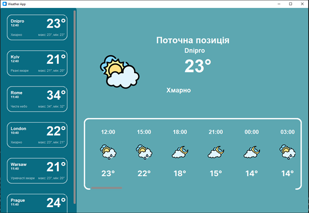
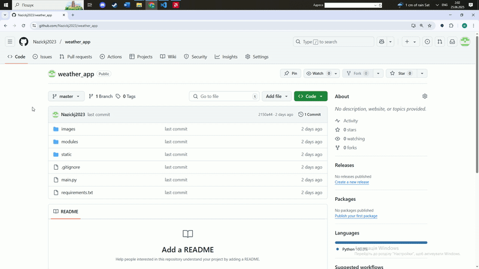
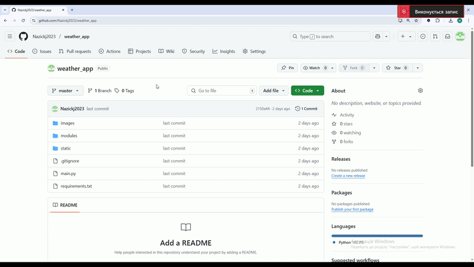
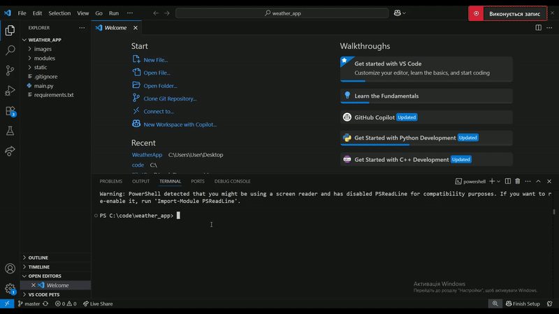
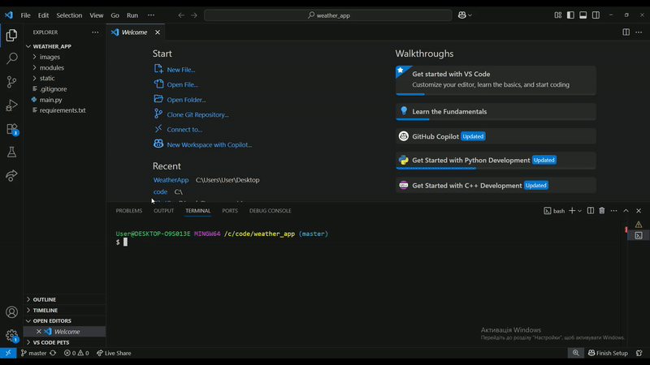
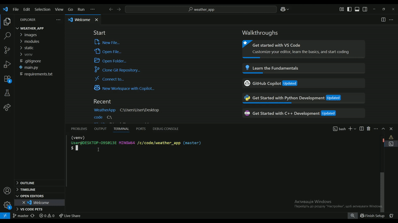
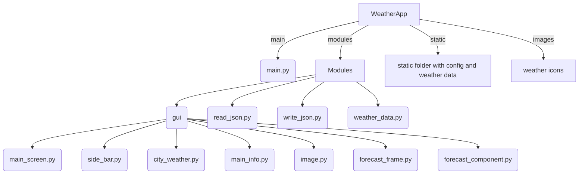

# Weather application



Цей проєкт розроблено з метою ознайомлення із роботою API, принципом отримання даних від віддаленого серверу, вмінням їх обробляти, структурувати та застосовувати у своєму проєкті. А саме застосовувалось API такого веб-ресурсу як [OpenWeatherMap](https://openweathermap.org). Проєкт допоможе розібратися із роботою файлів JSON, як правильно отримувати та зберігати дані у файлах з типом .json. Та познайомити користувача з інтерфейсом застосунку розробленим за допомогою пакету [CustomTkinter](https://customtkinter.tomschimansky.com)

---

### Зміст репозиторія:

1. [Основні модулі проєкту](#all-modules)  
2. [Розгортання проєкту](#download-project)  
3. [Створення віртуального оточення проєкту](#create-venv)  
4. [Завантаження модулів до віртуального оточення](#download-modules-venv)  
5. [Старт проєкту](#start-project)
6. [Основні механіки проєкту](#all-mechanics)
7. [Структура проекта](#all-mechanics)
8. [Висновок по проєкту](#result)  

---

### <h4 id='all-modules'>Основні модулі проєкту:</h4>

- [customtkinter](https://customtkinter.tomschimansky.com/)
- [json](https://docs.python.org/3/library/json.html)
- [requests](https://docs.python-requests.org/)
- [Pillow (PIL)](https://python-pillow.org/)
- [os](https://docs.python.org/3/library/os.html)
- [colorama](https://pypi.org/project/colorama/)
- [datetime](https://docs.python.org/3/library/datetime.html)
- [darkdetect](https://pypi.org/project/darkdetect/)
- [packaging](https://pypi.org/project/packaging/)

---

### <h4 id='download-project'>Розгортання проєкту:</h4>
Download project

#### 1. Склонувати з GitHub

```bash
git clone https://github.com/Nazickj2023/weather_app.git
```

*Або перегляньте коротке відео:*



#### 2. Завантажити як ZIP

- Перейдіть на сторінку GitHub репозиторію
- Натисніть `Code > Download ZIP`
- Розпакуйте архів на своєму пристрої



---

### <h4 id='create-venv'>Створення віртуального оточення проєкту:</h4>
Сreate venv

#### Windows

```bash
python -m venv venv
venv\Scripts\activate
```
*Або перегляньте коротке відео:*


#### Mac OS або Linux

```bash
python3 -m venv venv
source venv/bin/activate
```
*Або перегляньте коротке відео:*



---

### <h4 id='download-modules-venv'>Завантаження модулів до віртуального оточення:</h4>

#### 1. Окремими модулями (вручну):

```bash
pip install customtkinter requests pillow colorama darkdetect packaging datetime
```
*Або перегляньте коротке відео:*



#### 2. За допомогою `requirements.txt`:

```bash
pip install -r requirements.txt
```
*Або перегляньте коротке відео:*


---

### <h4 id='start-project'>Старт проєкту:</h4>

```bash
python main.py
```

Або для Linux/Mac:

```bash
python3 main.py
```

Ця команда запустить графічний застосунок, який дозволяє отримувати інформацію про погоду з OpenWeatherMap API.

---
### <h4 id='all-mechanics'>Основні механіки проєкту:</h4>

- Введення назви міста
- Отримання поточних погодних даних з API
- Виведення іконки погоди, температури, вологості, тиску, напрямку вітру
- Зберігання останнього запиту
- Підтримка темної/світлої теми


---
## Структура  проекта

---
## 🐍 `main.py`

```python
import modules

# Запускає додаток
if __name__ == "__main__":
    modules.app.mainloop()
```

> Запускає додаток

---

## 🧩 Modules / Модулі

### `weather_data.py`

```python
import requests
from .write_json import write

api_key = "<your_api_key>"

def get_info_weather(city_name: str, file_name: str, forecast: bool):
    if forecast:
        url = f'https://api.openweathermap.org/data/2.5/forecast?q={city_name}&appid={api_key}&lang=ua&units=metric'
    else:
        url = f'https://api.openweathermap.org/data/2.5/weather?q={city_name}&appid={api_key}&lang=ua&units=metric'

    data = requests.get(url)
    if data.status_code == 200:
        write(file_name, data.json())
    else:
        print("Error - ", data.status_code)
```

> Отримує дані про погоду та зберігає їх у JSON-файл.

---

### 🐍`read_json.py` / 🐍`write_json.py`

```python
# read_json.py
import os, json

def read(file_name: str):
    path = os.path.abspath(__file__ + '/../../static/' + file_name)
    with open(path, encoding='utf-8') as file:
        return json.load(file)
```

```python
# write_json.py
import json, os

def write(file_name: str, data: dict):
    path = os.path.abspath(__file__ + f"/../../static/{file_name}")
    with open(path, "w", encoding="utf-8") as file:
        json.dump(data, file, indent=4, ensure_ascii=False)
```

> Зберігає та зчитує дані про погоду з файлу.

---

## 📱 GUI / Інтерфейс

### `main_screen.py`

> Створює головне вікно програми на основі даних із config.json.

### `side_bar.py` →  Вертикальний контейнер з меню, що прокручується

### `city_weather.py` → Відображає блоки погоди для кількох міст

### `main_info.py` → Показує поточну погоду, температуру та опис для обраного міста

### `forecast_frame.py` + `forecast_component.py` → Прокручуваний прогноз погоди

### `image.py` → Завантажує та відображає іконки погоди за допомогою PIL

---


### <h2 id='result'>Висновок по проєкту:</h2>


**Weather App** — це десктопний застосунок з графічним інтерфейсом, який інтегрує сторонній API [OpenWeatherMap](https://openweathermap.org/) для отримання актуальної інформації про погоду.

Цей проєкт є чудовим прикладом для вивчення та практики ключових навичок сучасного Python-розробника:

- 🔗 Виконання HTTP-запитів та робота з API  
- 🧩 Обробка даних у форматі JSON  
- 📱 Розробка графічного інтерфейсу за допомогою бібліотеки **CustomTkinter**  
- 🧱 Організація структури Python-проєкту  
- ⚙️ Управління залежностями через **virtual environment**

---

## 🚀 Потенціал для розвитку

Цей застосунок можна використовувати як базову платформу для створення подібних погодних або інформаційних програм. Його легко розширити за рахунок:

- додавання прогнозу погоди на кілька днів,
- реалізації геолокації,
- кешування запитів для офлайн-доступу,
- підтримки кількох мов,
- адаптації інтерфейсу під мобільні пристрої (через web або multiplatform GUI-бібліотеки).

---

## 🏆 Результати

Під час реалізації проєкту було отримано цінний практичний досвід розробки повноцінного застосунку — від ідеї до створення, налаштування інтерфейсу, роботи з API та тестування функціоналу.

---
